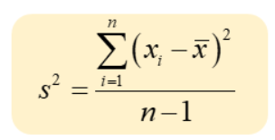

<center><h1>01B. Vector C++</h1></center>
<center>
<b>Time limit:</b> 1 s<br><b>Memory limit:</b> 256 MB
</center>

### Description
Salah satu bentuk struktur data yang paling umum dipakai adalah array. Baik Bahasa C maupun C++ mendukung penggunaan array untuk menyimpan data berupa beberapa buah nilai dengan tipe yang sama. Namun, array dalam bahasa C/C++ bersifat statis, artinya ukuran array harus ditentukan dari awal sebelum dibuat dan ketika sudah ditentukan, tidak dapat ditambah/dikurangi ukurannya. Hal ini dapat menyebabkan penggunaan memori yang kurang efisien.

Untuk mengatasi hal itu, pada Bahasa C++ disediakan pustaka bernama Standard Template Library (STL) yang memungkinkan kita menyimpan data dalam struktur yang serupa array, namun ukurannya bersifat dinamis (dapat menyesuaikan kebutuhan), yaitu dengan menggunakan struktur data vector (dari `<vector>`). Kita dapat mendeklarasikan lalu menyimpan data pada sebuah vector (satu-per-satu) dengan cara sebagai berikut:

```cpp
#include <vector>
using namespace std;
// ....
vector<int> data;
data.push_back(5);
data.push_back(3);
data.push_back(7);
```

Setelah kita menyimpan data pada sebuah vector, kita dapat mengakses elemen-elemen data yang ada pada vector tersebut dengan beberapa cara. Cara pertama adalah dengan menggunakan indeks array seperti biasa (dimulai dengan indeks 0, 1, ... dst).

```cpp
cout << data[0] << " " << data[2] << endl;  // menghasilkan keluaran '5 7'
```

Cara kedua adalah ketika kita ingin mengakses semua elemen secara berurutan, maka kita dapat menggunakan sintaks ranged for loop yang baru sebagai berikut:

```cpp
for (auto x : data) 
    cout << x << " "; // menghasilkan keluaran '5 3 7'
```

Vector juga menyediakan sarana untuk melakukan berbagai operasi yang diperlukan, misalnya: menghitung banyaknya elemen saat ini, mengkosongkan vector, menambah/menghapus elemen vector di akhir, dan sebagainya. Berikut adalah link untuk membaca lebih lanjut tentang vector di C++.
- https://en.cppreference.com/w/cpp/container/vector

Gunakanlah vector untuk menyelesaikan soal di bawah ini. 

Seorang dosen ingin menghitung rataan dan ragam dari data nilai-nilai ujian dalam kelasnya. Lebih lanjut, dosen tersebut hanya ingin menghitung rataan dan ragam dari semua nilai yang lebih besar atau sama dengan sebuah batas minimal tertentu, **M**. Semua nilai yang kurang dari batas minimal tersebut akan diabaikan. Bantulah dosen tersebut untuk menentukan rataan dan ragam yang diinginkan. 

### Input Format
Masukan dimulai dengan satu baris berisi satu bilangan bulat yang menunjukkan nilai minimum M yang menjadi batas yang diinginkan. Baris kedua berisi beberapa buah bilangan bulat yang merupakan kumpulan nilai-nilai (non-negatif) yang akan dihitung rataan dan ragamnya. Nilai-nilai ini diakhiri dengan sebuah nilai -1 yang menunjukkan akhir dari data (dan bukan merupakan bagian dari data yang akan dihitung rataan & ragamnya).

```txt
M
A1 A2 … AN -1
```

### Output Format
Keluaran adalah sebuah baris dengan dua buah nilai, yaitu rataan dan ragam dari semua nilai A1, A2, ... , AN yang lebih besar atau sama dengan M.

### Batasan
- 1≤N≤10000
- 0≤M,Ai≤100

### Sample Input
```txt
70
83 65 95 45 75 -1
```

### Sample Output
```txt
84.33 101.33
```

### Penjelasan Contoh 1
Ada 5 buah nilai, yaitu 83, 65, 95, 45 dan 75. Nilai minimum yang diinginkan adalah 70. Dari nilai-nilai tersebut, hanya 3 nilai yang memenuhi, yaitu: 83, 95 dan 75. Rataan dari ketiga nilai tersebut adalah 84.33, sedangkan ragamnya adalah 101.33. 

**Hint:** Untuk soal ini, gunakan formula ragam sample (bukan ragam populasi) sebagai berikut:<br>

