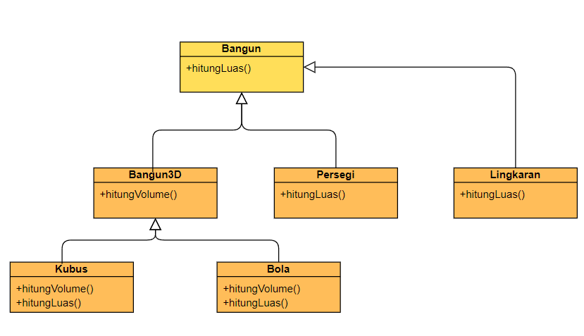

<center><h1>04A. Polimorfisme C++</h1></center>
<center>
<b>Time limit:</b> 1 s<br><b>Memory limit:</b> 256 MB
</center>

### Description
Pada soal ini Anda diminta untuk mengimplementasikan konsep polimorfisme sederhana pada C++. Kita akan melambangkan objek bangun 2D dan 3D menjadi kelas-kelas pada C++ dengan struktur sebagai berikut (perhatikan diagram di bawah ini):
- Seluruh kelas merupakan turunan dari kelas abstrak Bangun yang hanya memiliki metode abstrak hitungLuas()
- Kelas Persegi dan Lingkaran merupakan turunan dari kelas Bangun yang mendefinisikan metode hitungLuas()
- Kelas Bangun3D merupakan kelas abstrak yang diturunkan dari kelas Bangun serta menambahkan metode abstrak hitungVolume()
- Kelas Kubus dan Bola merupakan kelas turunan dari kelas Bangun3D yang mendefinisikan metode hitungLuas() (untuk menghitung luas permukaan bangun 3D) serta metode hitungVolume().

Perhatikan diagram di bawah ini.


Diberikan serangkaian obyek 3D dan datanya, hitunglah total luas dan volume dari semua obyek.

### Batasan
- 1≤N≤1000
- 1≤Ai≤1000000

### Input Format
Masukan diberikan dalam format berikut: Baris pertama berisi bilangan bulat positif N, menyatakan banyaknya obyek. N baris berikutnya berisi masing-masing satu buah obyek. Data satu buah obyek terdiri dari 2 nilai. Nilai pertama adalah sebuah karakter yang menyatakan kode jenis obyek, sedangkan nilai kedua adalah sebuah bilangan pecahan yang menyatakan ukuran obyek. Kode obyek adalah sebagai berikut:
- P = persegi
- L = lingkaran
- K = kubus
- B = bola

### Output Format
Keluarkan adalah dua buah baris, masing-masing berupa bilangan pecahan dengan dua desimal di belakang koma. Baris pertama berisi total semua luas (termasuk luas permukaan bangun 3D),sedangkan baris kedua berisi total volume bangun 3D.

**Catatan:** Gunakan nilai PI = 3.1425.

### Sample Input
```txt
5
L 5.6
P 2.5
K 8.8
B 2.3
L 7.1
```

### Sample Output
```txt
794.35
732.45
```